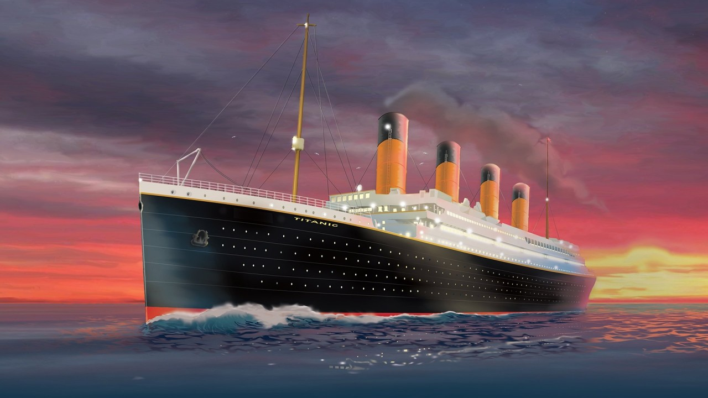

### Titanic Survival Prediction

The Titanic was a British passenger liner that sank in the North Atlantic Ocean during its maiden voyage on April 15, 1912. The ship was traveling from Southampton, England, to New York City, United States. Among the passengers were third-class and first-class passengers, as well as crew members.

The Titanic sank after colliding with an iceberg, resulting in the deaths of most of the third-class passengers and some of the crew members. However, the ship's lifeboats were not enough to accommodate all the passengers, leading to a significant number of fatalities.

In this project, a dataset was given containining the records of some of the passengers of the Titanic to use to build a model that predicts whether a passenger on the Titanic survived or not. 

The following steps were taken:
1. Importing all the lbriaries needed for the task
2. Loading and carrying out data exploration to understand the data and its structures
3. Preparing the data for modeling through data cleaning 
4. Creating the necessary model and testing
5. and then data visualisations
